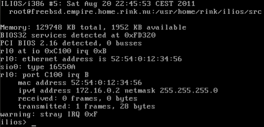

# ILIOS

ILIOS, _InterLink Internet Operating System_, was intended to be a router-only OS. It was designed for maximum throughput on any i386+ system. However, during tests, it barely beat a [NetBSD](https://www.NetBSD.org) system on exactly the same hardware. Therefore, I deemed it simply was too much effort to invest time in this, and the project was cancelled.

However, ILIOS does feature working IPv4 routing, which is reasonably fast. It is based on the [XeOS](https://github.com/zhmu/xeos) codebase, even though the entire OS is singletasking and relies on interrupts for processing.

## Screenshot

## Downloads

 * [Final release](releases/ilios-20051009.tar.bz2), 2005-10-09 (320KB)
 * [Demonstration disk image](releases/ilios-20110811.img.bz2) 2011-08-11 (164KB)
